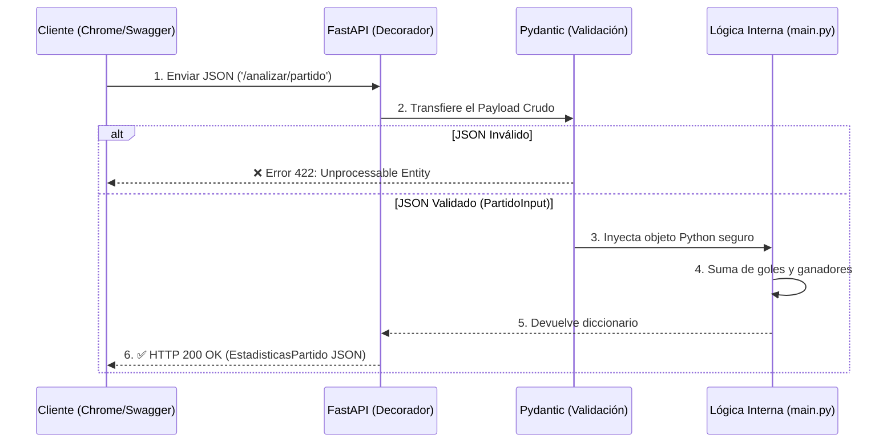

# Reflexiones Fase 5: API Analítica Universal y de Fútbol

## Pregunta 1 — Dominio y Validaciones
**¿Por qué eligió ese dominio? Describa las validaciones Pydantic que implementó y justifique por qué son necesarias para la integridad de los datos en su contexto específico.**

Elegí trabajar con datos de fútbol histórico porque tiene una combinación interesante de variables de texto (países, equipos) y números (goles) que son ideales para graficar. Para proteger esto, creé el modelo Pydantic `PartidoInput`. Este modelo exige que los nombres de los equipos ingresen como texto (`str`) y los goles como números enteros (`int`). Estas validaciones son vitales para mi proyecto porque el motor interno que construí usa la librería Pandas para sumar los goles y sacar promedios. Si alguien enviara la palabra "cinco" en lugar del número `5`, la matemática de mi código fallaría al intentar sumar letras con números, corrompiendo la tabla general y los gráficos del frontend.

## Pregunta 2 — Sin Validación
**¿Qué sucedería concretamente en su API si eliminara todas las validaciones Pydantic? Dé un ejemplo de un JSON malformado específico para su dominio y explique qué error produciría.**

Si quitara Pydantic, la API confiaría a ciegas en lo que mande el cliente. Por ejemplo, si un usuario envía este JSON:
```json
{
  "equipo_local": "Colombia",
  "equipo_visitante": "Brasil",
  "goles_local": "dos",
  "goles_visitante": null
}
```
Como ya no hay filtro, el JSON pasaría directo a mi archivo `main.py`. Ahí, cuando el código intente ejecutar `goles_local + goles_visitante`, Python intentaría literalmente sumar la cadena `"dos"` con el objeto `None`. Esto provocaría un `TypeError` interno inmediato, la aplicación colapsaría y el usuario de la web recibiría un error 500 (Internal Server Error) genérico, en lugar de recibir un mensaje claro de que se equivocó llenando el formulario (Error 422).

## Pregunta 3 — Escalabilidad
**Si su API recibiera 10,000 requests por minuto, ¿qué problema tendría su implementación actual con el diccionario en memoria? Proponga una alternativa concreta.**

El principal problema es que mi código actual guarda todo el historial en un simple diccionario de Python (`historial = {}`) que vive temporalmente en la memoria RAM de mi computadora. Si recibo 10,000 análisis por minuto, la memoria de mi servidor se llenaría rapidísimo y se caería. Además, cada vez que hago algún cambio y el servidor Uvicorn se reinicia, todos los datos que los usuarios subieron se borran instantáneamente. Para llevar el proyecto a un escenario real donde los datos perduren, la alternativa concreta es reemplazar el diccionario por una base de datos de verdad persistente usando, por ejemplo, PostgreSQL administrado con SQLAlchemy, o MongoDB si quisiera guardar todos estos análisis JSON de forma flexible en el disco duro.

## Pregunta 4 — Flujo Completo
**Dibuje o describa el flujo completo de un request POST a su endpoint principal: desde que el cliente envía el JSON hasta que recibe la respuesta. Mencione: decorador, Pydantic, función de lógica, y respuesta HTTP.**

El siguiente diagrama ilustra el flujo exacto del proyecto al consultar el endpoint individual:



**Explicación paso a paso:**
1. **El Cliente** (mi página web o el Swagger) hace un POST y le envía el archivo JSON a la ruta `/analizar/partido`.
2. **El Decorador:** FastAPI atrapa esa solicitud mágica gracias a que definí `@app.post(...)`.
3. **Pydantic:** Recibe el JSON y revisa estrictamente que todos los campos cumplan con el modelo `PartidoInput`. Si ve que mandaron texto donde iban números, rechaza la petición y devuelve un error 422.
4. **Lógica Interna:** Si los datos pasan la prueba, entran a mi función `procesar_partido_individual()`. Aquí es donde Python suma los goles, calcula los ganadores con condicionales y guarda la respuesta en el diccionario que funciona como memoria.
5. **Respuesta HTTP:** Ya con el cálculo hecho, FastAPI formatea los resultados basándose en la clase `EstadisticasPartido` y se los devuelve a la página web confirmando el éxito con un estado **200 OK**.

---

## Evidencias de Pruebas API (Fase 5 - Swagger UI)

A continuación se presentan las capturas de pantalla de la documentación interactiva Swagger UI demostrando el correcto funcionamiento de los Endpoints de la API:

### 📸 Prueba 1: POST Exitoso (Carga de Datos)
*Demostración del endpoint `/analizar/csv` recibiendo un archivo válido y respondiendo con Status Code 200 y las métricas calculadas.*


### 📸 Prueba 2: POST Denegado (Error de Validación 422)
*Demostración del endpoint `/analizar/partido` interceptando un Request sin los campos obligatorios gracias a la validación estricta de Pydantic, devolviendo Status Code 422.*


### 📸 Prueba 3: GET /historial (Persistencia en Memoria)
*Demostración del endpoint listando el historial de análisis previamente almacenados, comprobando la persistencia de datos (Status Code 200).*


### 📸 Prueba 4: GET /historial/{id} (Error 404 Controlado)
*Demostración de manejo de excepciones solicitando un ID de análisis inexistente, lo que genera una respuesta controlada con Status Code 404.*


### 📸 Prueba 5: DELETE /historial/{id} (Eliminación Exitosa)
*Demostración del endpoint de borrado eliminando un registro existente en memoria y confirmando la operación con Status Code 200.*


### 📸 Prueba 6: Swagger UI + terminal con uvicorn corriendo
*Demostración de la API corriendo localmente. Captura de pantalla completa mostrando la interfaz de Swagger UI en el navegador y la terminal de VS Code ejecutando el servidor uvicorn simultáneamente.*


