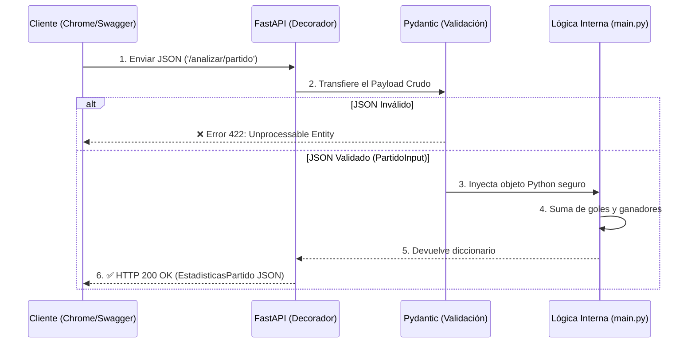

# Reflexiones Fase 5: API Analítica Universal y de Fútbol

## Pregunta 1 — Dominio y Validaciones
**¿Por qué eligió ese dominio? Describa las validaciones Pydantic que implementó y justifique por qué son necesarias para la integridad de los datos en su contexto específico.**

El proyecto comenzó enfocado en el dominio de partidos históricos de fútbol internacional para predecir ganadores basados en locación (local/visitante), un campo con muchas variables categóricas y numéricas. Implementé el modelo Pydantic `PartidoInput` que exige estrictamente que los nombres de los equipos (`equipo_local`, `equipo_visitante`) sean textos (`str`) y que los marcadores (`goles_local`, `goles_visitante`) sean enteros (`int`). Estas validaciones son críticas en el contexto matemático de la API: si un cliente mandara goles como texto ("cinco"), operaciones de agregación y sumas (`total_goles = goles_local + goles_visitante`) fallarían, rompiendo toda la lógica del análisis estadístico y corrompiendo el estado de la aplicación.

## Pregunta 2 — Sin Validación
**¿Qué sucedería concretamente en su API si eliminara todas las validaciones Pydantic? Dé un ejemplo de un JSON malformado específico para su dominio y explique qué error produciría.**

Sin Pydantic, la API intentaría procesar ciegamente cualquier basura que le llegue. Por ejemplo, al enviar este JSON:
```json
{
  "equipo_local": "Colombia",
  "equipo_visitante": "Brasil",
  "goles_local": "dos",
  "goles_visitante": null
}
```
En el código de `main.py`, la línea `goles_local + goles_visitante` intentaría sumar el texto `"dos"` con el objeto `None`. Esto detonaría una excepción interna de Python (TypeError) y colapsaría el endpoint, devolviéndole al usuario un error fatal `Code 500 Internal Server Error`, en lugar de un mensaje controlado que le explique qué campo ingresó mal (`Code 422`).

## Pregunta 3 — Escalabilidad
**Si su API recibiera 10,000 requests por minuto, ¿qué problema tendría su implementación actual con el diccionario en memoria? Proponga una alternativa concreta.**

El uso actual del diccionario global (`historial = {}`) en memoria RAM colapsaría rápidamente. 10,000 peticiones por minuto de análisis masivos acabarían con la RAM del servidor en pocos minutos provocando un error "Out of Memory" (OOMKill). Además, si `uvicorn` reinicia el proceso por una falla, absolutamente todos los datos se perderían instantáneamente. Por último, un diccionario de Python básico no es "thread-safe" para bases gigantes con alta concurrencia. La alternativa concreta sería conectar la API a una base de datos real persistente, como **PostgreSQL** usando la librería **SQLAlchemy** (para datos estructurados SQL), o **MongoDB** si se desea guardar los JSON analíticos de manera flexible como documentos.

## Pregunta 4 — Flujo Completo
**Dibuje o describa el flujo completo de un request POST a su endpoint principal: desde que el cliente envía el JSON hasta que recibe la respuesta. Mencione: decorador, Pydantic, función de lógica, y respuesta HTTP.**

El siguiente diagrama ilustra el flujo exacto del proyecto al consultar el endpoint individual:



**Explicación por pasos (Componentes solicitados):**
1. **El Cliente** envía el archivo o payload JSON a través de POST.
2. **Decorador:** FastAPI intercepta esto matemáticamente a través de `@app.post("/analizar/partido", response_model=...)`.
3. **Pydantic:** Actúa instantáneamente como un filtro. Intenta mapear los datos hacia la clase `PartidoInput`. Si hay un error de tipo (ej. letras en vez de números), rechaza y responde un código HTTP `422`.
4. **Función de Lógica:** Si Pydantic aprueba, se gatilla la función `procesar_partido_individual()`. Aquí ocurre la matemática (ej. sumar goles) y se almacena en memoria (`historial`).
5. **Respuesta HTTP:** FastAPI toma el return calculado, esconde lo irrelevante formateándolo con el esquema `EstadisticasPartido`, y devuelve al cliente un exitoso Código **200 OK**.

---

## Evidencias de Pruebas API (Fase 5 - Swagger UI)

A continuación se presentan las capturas de pantalla de la documentación interactiva Swagger UI demostrando el correcto funcionamiento de los Endpoints de la API:

### 📸 Prueba 1: POST Exitoso (Carga de Datos)
*Demostración del endpoint `/analizar/csv` recibiendo un archivo válido y respondiendo con Status Code 200 y las métricas calculadas.*


### 📸 Prueba 2: POST Denegado (Error de Validación 422)
*Demostración del endpoint `/analizar/partido` interceptando un Request sin los campos obligatorios gracias a la validación estricta de Pydantic, devolviendo Status Code 422.*


### 📸 Prueba 3: GET /historial (Persistencia en Memoria)
*Demostración del endpoint listando el historial de análisis previamente almacenados, comprobando la persistencia de datos (Status Code 200).*


### 📸 Prueba 4: GET /historial/{id} (Error 404 Controlado)
*Demostración de manejo de excepciones solicitando un ID de análisis inexistente, lo que genera una respuesta controlada con Status Code 404.*


### 📸 Prueba 5: DELETE /historial/{id} (Eliminación Exitosa)
*Demostración del endpoint de borrado eliminando un registro existente en memoria y confirmando la operación con Status Code 200.*

